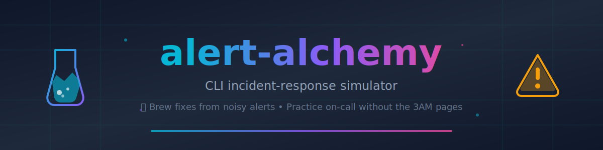
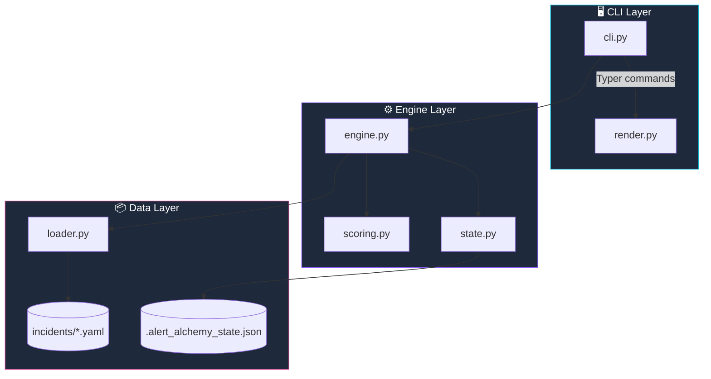
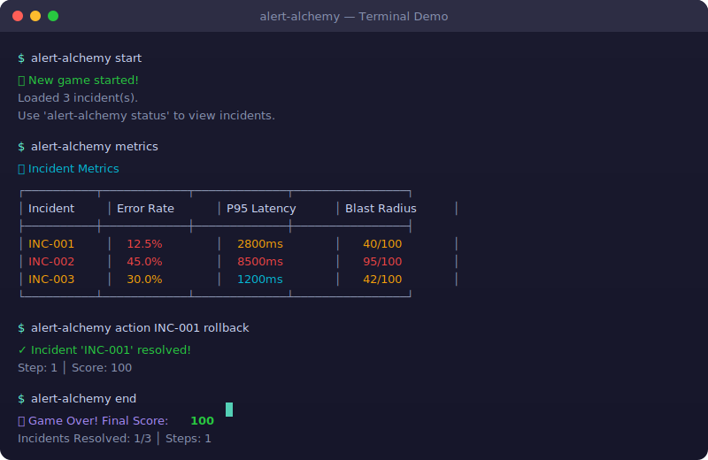

<p align="center">
  <strong>🧪 Practice incident response without the 3AM pages — brew fixes from noisy alerts in your terminal!</strong>
</p>

<p align="center">
  <a href="https://github.com/ThanhNguyxn/alert-alchemy/actions/workflows/ci.yml"></a>
  <a href="https://www.python.org/"></a>
  <a href="LICENSE"></a>
  <a href="https://github.com/ThanhNguyxn/alert-alchemy/pulls"></a>
  
  
  
</p>

<p align="center">
  <a href="https://thanhnguyxn.github.io/alert-alchemy/"></a>
  <a href="https://buymeacoffee.com/thanhnguyxn"></a>
</p>

<p align="center">
  
  
  
  
</p>

---

## 📑 Table of Contents

- [✨ Why Alert Alchemy?](#-why-alert-alchemy)
- [🧪 Features](#-features)
- [🌐 Play in Browser](#-play-in-browser)
- [📦 Download & Run (No Python Needed)](#-download--run-no-python-needed)
- [🧰 Developer Install](#-developer-install)
- [🎮 Gameplay Loop](#-gameplay-loop)
- [🧰 Commands](#-commands)
- [🧾 Incident Schema](#-incident-schema)
- [🧬 Example Incident YAML](#-example-incident-yaml)
- [🏗️ Architecture](#️-architecture)
- [🧮 Scoring & Blast Radius](#-scoring--blast-radius)
- [🗺️ Roadmap](#️-roadmap)
- [❓ FAQ](#-faq)
- [🤝 Contributing](#-contributing)
- [🔐 Security](#-security)
- [📜 License](#-license)

---

## ✨ Why Alert Alchemy?


Ever wished you could **practice incident response** without production going down at 3AM? 

Alert Alchemy is a **terminal-based simulator** that drops you into realistic on-call scenarios. You'll diagnose issues from logs, metrics, and traces — then choose actions that actually matter. Make the wrong call? Watch your score plummet. Nail it in two steps? Get bonus points! 🏆

**Perfect for:**
- 🆕 New SREs learning the ropes
- 👩‍💻 Teams running game days or training
- 🎯 Anyone who wants to sharpen incident response skills

---

## 🧪 Features


| Feature | Description |
|---------|-------------|
| 🎮 **Turn-based gameplay** | Think before you act — time advances only when you do |
| 📊 **Real metrics** | Error rates, p95 latency, CPU/memory — just like production |
| 📜 **Logs & traces** | Dig through realistic observability data |
| 🎯 **Blast radius scoring** | See the impact of each incident at a glance |
| ✅ **Multiple resolution paths** | Not always one right answer — trade-offs matter |
| 🔌 **Offline friendly** | No internet required, no containers, just Python |
| 📝 **Extensible incidents** | Write your own YAML scenarios |

---

## 🌐 Play in Browser

**No installation required!** Play directly in your browser:

👉 **[https://thanhnguyxn.github.io/alert-alchemy/](https://thanhnguyxn.github.io/alert-alchemy/)**

- ✅ Zero backend — runs entirely in your browser  
- ✅ Works offline after first load  
- ✅ Progress saved in localStorage  

---

## 📦 Download & Run (No Python Needed)


Don't want to install Python? Download a pre-built executable from the [Releases page](https://github.com/ThanhNguyxn/alert-alchemy/releases).

### Windows

1. Download `alert-alchemy-windows.zip` from [Releases](https://github.com/ThanhNguyxn/alert-alchemy/releases)
2. Extract the zip file
3. **Double-click `PLAY.bat`** — that's it!

Or run from Command Prompt:
```powershell
.\alert-alchemy.exe
```

### macOS

1. Download `alert-alchemy-macos.zip` from [Releases](https://github.com/ThanhNguyxn/alert-alchemy/releases)
2. Extract the zip file
3. Open Terminal in the extracted folder
4. Make it executable and run:
   ```bash
   chmod +x alert-alchemy
   ./alert-alchemy start
   ```

> [!NOTE]
> On macOS, you may need to allow the app in **System Preferences → Security & Privacy** if you see a "cannot be opened" warning.

### Linux

1. Download `alert-alchemy-linux.zip` from [Releases](https://github.com/ThanhNguyxn/alert-alchemy/releases)
2. Extract the zip file
3. Open Terminal in the extracted folder
4. Make it executable and run:
   ```bash
   chmod +x alert-alchemy
   ./alert-alchemy start
   ```

---

## 🧰 Developer Install


### Windows

```powershell
# Clone the repo
git clone https://github.com/ThanhNguyxn/alert-alchemy.git
cd alert-alchemy

# Create virtual environment
python -m venv .venv
.\.venv\Scripts\activate

# Install
pip install -e .

# Play!
alert-alchemy start
```

### macOS / Linux

```bash
# Clone the repo
git clone https://github.com/ThanhNguyxn/alert-alchemy.git
cd alert-alchemy

# Create virtual environment
python3 -m venv .venv
source .venv/bin/activate

# Install
pip install -e .

# Play!
alert-alchemy start
```

### 🎯 Beginner Mode (Recommended)

New to the game? Use the interactive guided mode:

```bash
alert-alchemy start   # Start a new game
alert-alchemy play    # Enter interactive mode with menus!
```

The `play` command provides a menu-driven interface — no need to memorize commands!

### 🚀 Quick Commands

```bash
# View what's happening
alert-alchemy status  # See all incidents
alert-alchemy actions # List available actions per incident

# Take action (multiple ways!)
alert-alchemy action INC-001 rollback   # Explicit: incident + action
alert-alchemy action rollback           # Easy: auto-selects if 1 incident
alert-alchemy action                    # Interactive: prompts for choices
```

Included scenarios:
- `INC-001` — Memory Leak in User Service
- `INC-002` — Database Connection Pool Exhaustion  
- `INC-003` — Feature Flag Misconfiguration

---

## 🎮 Gameplay Loop


```
┌─────────────────────────────────────────────────────┐
│  1. START    →  Load incidents, initialize game    │
│  2. OBSERVE  →  Check status, logs, metrics        │
│  3. DECIDE   →  Pick an action for an incident     │
│  4. ACT      →  Time advances, score updates       │
│  5. REPEAT   →  Until all incidents resolved       │
│  6. END      →  See final score & breakdown        │
└─────────────────────────────────────────────────────┘
```

**Key insight:** Viewing data (`status`, `logs`, `metrics`, `traces`) is **free** — no time penalty! But every `action` or `tick` advances the clock.

---

## 🧰 Commands

| Command | Advances Time | Description |
|---------|:-------------:|-------------|
| `start` | — | 🎮 Start a new game session |
| `play` | — | 🕹️ **Interactive guided mode** (recommended!) |
| `status` | ❌ | 📋 Show current incidents & game state |
| `logs` | ❌ | 📜 Display incident logs |
| `metrics` | ❌ | 📊 Show metrics table for all incidents |
| `traces` | ❌ | 🔍 Display distributed traces |
| `actions` | ❌ | 📋 List available actions per incident |
| `action [id] [name]` | ✅ +1 | ⚡ Take an action (id optional if 1 incident) |
| `tick` | ✅ +1 | ⏰ Advance time without acting |
| `end` | — | 🏁 End game and show final score |
| `reset` | — | 🔄 Clear game state |
| `show <id>` | ❌ | 🔎 Show details of specific incident |

**Shortcut:** Use `aa` instead of `alert-alchemy` for faster typing!

---

## 🧾 Incident Schema

Incidents are defined in YAML files under `incidents/`. Here's the schema:

```yaml
id: INC-001
title: "Short title"
severity: critical | high | medium | low
description: "What's happening..."
metrics:
  error_rate: 25.0      # Required for blast radius
  p95_latency: 2500     # Required for blast radius
available_actions: [rollback, scale, restart, disable-flag, ...]
correct_action: rollback
logs: ["[timestamp] message", ...]
traces: ["trace-id: path -> outcome", ...]
```

📖 **Full guide:** [docs/write-an-incident.md](docs/write-an-incident.md)

---

## 🧬 Example Incident YAML


<details>
<summary>Click to expand full example</summary>

```yaml
# incidents/001-memory-leak.yaml
id: INC-001
title: "Memory Leak in User Service"
severity: high
description: |
  The user-service pods are experiencing OOMKilled restarts every 2-3 hours.
  Memory usage climbs linearly from startup until the 4GB limit is hit.

services:
  - user-service
  - api-gateway

metrics:
  error_rate: 12.5
  p95_latency: 2800
  cpu_usage: 45.0
  memory_usage: 98.0

logs:
  - "[03:14:02] WARN  user-service-7b4f8d Pod memory at 3.8GB/4GB"
  - "[03:14:15] ERROR user-service-7b4f8d OOMKilled - restarting container"
  - "[03:15:01] WARN  api-gateway upstream user-service unhealthy"

traces:
  - "trace-a1b2c3: GET /api/users/profile -> user-service (timeout after 5000ms)"
  - "trace-g7h8i9: Heap dump shows 1.2GB retained by SessionCache"

available_actions:
  - rollback
  - scale
  - restart
  - disable-flag
  - increase-pool
  - enable-cache

correct_action: rollback

resolution:
  optimal_path: ["rollback"]
  explanation: |
    The memory leak was introduced in v2.3.1. Rolling back immediately
    stabilizes memory while a hotfix is prepared.
```

</details>

---

## 🏗️ Architecture



---

## 🧮 Scoring & Blast Radius


### Score Calculation

| Component | Points |
|-----------|-------:|
| Base score | +100 |
| Per elapsed step | -10 |
| Per wrong action | -15 |
| If action worsens situation | -5 |
| Quick resolve (≤2 steps) | +10 |

### Blast Radius (0-100)

Derived from incident metrics:

```
blast_radius = min(100, error_rate_contribution + latency_contribution)

error_rate_contribution = (error_rate / 50) × 50   # max 50
latency_contribution = (p95_latency / 5000) × 50   # max 50
```

If no metrics → fallback to severity (critical=80, high=60, medium=40, low=20)

---

## 🖼️ Demo



---

## 🗺️ Roadmap


- [x] Core CLI + game engine
- [x] YAML incident loader
- [x] Scoring system with blast radius
- [x] Initial incident pack (3 scenarios)
- [ ] More incident packs (networking, K8s, AWS)
- [ ] Timed challenge mode
- [ ] Multiplayer/team mode
- [ ] Leaderboard submission
- [ ] Incident replay & analysis
- [ ] Web UI (optional)

---

## ❓ FAQ

<details>
<summary><strong>Do I need an internet connection?</strong></summary>

Nope! Alert Alchemy runs entirely offline. All incidents are local YAML files.

</details>

<details>
<summary><strong>Can I create my own incidents?</strong></summary>

Absolutely! Check out [docs/write-an-incident.md](docs/write-an-incident.md) for the full guide.

</details>

<details>
<summary><strong>Does this work on Windows?</strong></summary>

Yes! Works on Windows, macOS, and Linux. Just need Python 3.11+.

</details>

<details>
<summary><strong>Is this good for team training?</strong></summary>

Definitely. Run the same incidents across your team and compare scores. Great for game days!

</details>

---

## 🤝 Contributing


We'd love your help! Whether it's:

- 🐛 Bug reports
- ✨ New incident scenarios
- 📖 Documentation improvements
- 🎨 UI/UX enhancements

Check out [CONTRIBUTING.md](CONTRIBUTING.md) for guidelines.

---

## 🔐 Security

Found a security issue? Please **do not** open a public issue. Instead, email the maintainers directly or open a private security advisory on GitHub.

- 🔐 Security: [SECURITY.md](SECURITY.md)
- 📜 Code of Conduct: [CODE_OF_CONDUCT.md](CODE_OF_CONDUCT.md)
---

## 📜 License

MIT © [Alert Alchemy Contributors](LICENSE)

---

<p align="center">
  
  
  
  
</p>

<p align="center">
  <strong>Built with 💜 for the on-call engineers who keep the world running</strong>
</p>
